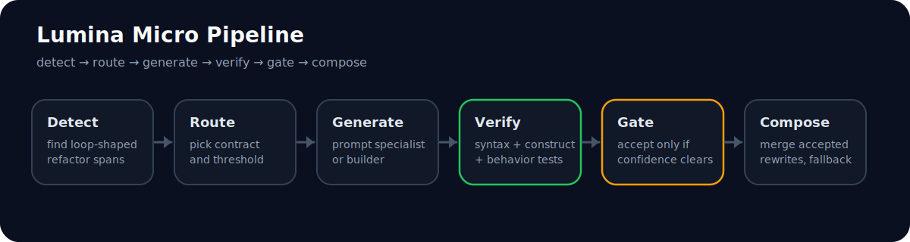

# Lumina Micro

Lumina Micro is a verifier-gated local refactoring runtime for narrow JavaScript
contracts.

It is designed around one idea:

> detect → route → generate → verify → gate → compose

The current claim is narrow on purpose:

> For small JavaScript refactor contracts, verifier-backed specialists and
> confidence-gated acceptance can produce high-precision local transformations.

## What this is

- a local refactoring pipeline for exact JavaScript loop-rewrite contracts
- a verifier-backed runtime that can accept or reject rewrites safely
- a research artifact with a public eval matrix and transfer-calibration work

## What this is not

- not a general coding agent
- not a claim that learned specialists beat deterministic rewriting everywhere
- not a finished shared-base adapter runtime
- not evidence of universal confidence across tasks

## Pipeline



## Example

Prompt:

```text
Refactor this JavaScript into more idiomatic functional code.
```

Input:

```js
const names = [];
for (const user of users) {
  names.push(user.name.toUpperCase());
}

let totalAge = 0;
for (const user of users) {
  totalAge += user.age;
}

const usersById = {};
for (const user of users) {
  usersById[user.id] = user;
}
```

Output:

```js
const names = users.map(user => user.name.toUpperCase());

let totalAge = users.reduce((a, b) => a + b.age, 0);

const usersById = users.reduce((acc, user) => ({ ...acc, [user.id]: user }), {});
```

The local runtime takes a normal refactor request, finds transformable spans,
routes them to a contract, verifies the rewrite, and only keeps it if it clears
the contract threshold.

Promoted contracts:

- `js_array_loop_to_map`
- `js_reduce_accumulator_refactor`
- `js_reduce_object_index_builder`

## Eval snapshot

Current public comparison surface: `examples/public_eval_v2.jsonl`

| Contract | Builder pass | Prompt pass | Runtime coverage | Runtime selective acc |
| --- | ---: | ---: | ---: | ---: |
| `js_array_loop_to_map` | `1.000` | `1.000` | `1.000` | `1.000` |
| `js_reduce_accumulator_refactor` | `1.000` | `0.500` | `0.500` | `1.000` |
| `js_reduce_object_index_builder` | `1.000` | `0.750` | `0.750` | `1.000` |

Interpretation:

- deterministic rewriting is a strong baseline on this slice
- prompt-only generation is weaker on some reduce/object-index rows
- the runtime’s clearest value is high-precision selective acceptance, not broad
  superiority over deterministic rewriting

## Strongest current claim

The most defensible way to describe this repo today is:

> A verifier-backed local code transformation runtime where narrow contract
> specialists improve pass rates on exact refactor tasks, and selective
> acceptance improves precision relative to prompt-only generation.

## Fastest commands

Mock demo:

```bash
bash tools/run_demo_present.sh
```

Ollama demo:

```bash
LUMINA_MICRO_BACKEND=ollama \
LUMINA_MICRO_OLLAMA_MODEL=llama3.1:latest \
LUMINA_MICRO_OLLAMA_KEEPALIVE=5m \
bash tools/run_demo_present.sh
```

Benchmark:

```bash
LUMINA_MICRO_BACKEND=ollama \
LUMINA_MICRO_OLLAMA_MODEL=llama3.1:latest \
LUMINA_MICRO_OLLAMA_KEEPALIVE=5m \
LUMINA_MICRO_ITERATIONS=3 \
LUMINA_MICRO_COLD_FIRST=1 \
bash tools/run_bench_demo.sh
```

Public eval:

```bash
bash tools/run_public_eval_builder.sh
LUMINA_MICRO_EVAL_BACKEND=ollama bash tools/run_public_eval_prompt.sh
LUMINA_MICRO_EVAL_BACKEND=ollama bash tools/run_public_eval_runtime.sh
bash tools/run_public_eval_aggregate.sh
```

Confidence-source comparison:

```bash
LUMINA_MICRO_EVAL_BACKEND=ollama \
bash tools/run_public_eval_compare_confidence.sh
```

Object-index transfer calibration:

```bash
LUMINA_MICRO_EVAL_BACKEND=ollama \
bash tools/run_object_index_transfer_calibration.sh

LUMINA_MICRO_EVAL_BACKEND=ollama \
bash tools/run_public_eval_compare_calibrated.sh
```

`run_object_index_transfer_calibration.sh` fits the local object-index transfer
calibrator. Run it before `run_public_eval_compare_calibrated.sh`.

## Confidence-provider seam

The eval matrix stays fixed while confidence changes:

```bash
LUMINA_MICRO_CONFIDENCE_PROVIDER=heuristic
LUMINA_MICRO_CONFIDENCE_PROVIDER=linear \
LUMINA_MICRO_CONFIDENCE_MODEL=artifacts/example_linear_confidence_model.json
LUMINA_MICRO_CONFIDENCE_PROVIDER=probe_bundle \
LUMINA_MICRO_CONFIDENCE_MODEL=artifacts/research_heads/js_reduce_object_index_builder_confidence_probe.pt
```

Current state:

- `linear` is a schema/example path
- `probe_bundle` is real for `js_reduce_object_index_builder`
- the raw persisted head does not transfer cleanly to the local Ollama runtime
- the repo includes a transfer-calibration path for that mismatch

## Main limitation

The local runtime still uses a single Ollama backend.

That means:

- the interface is shaped like a shared-base specialist system
- the deployment is not yet true adapter swapping

## Best read order

1. `paper/research_note.md`
2. `paper/results_table.md`
3. `paper/appendix_methods.md`
4. `paper/case_gallery.md`
5. `paper/public_eval_harness.md`
6. `paper/positioning.md`

## Local prerequisites

- Python `3.11+`
- Node.js on `PATH`
- Ollama for local model execution

Install:

```bash
python -m pip install -e .
```

## License

MIT. See `LICENSE`.
